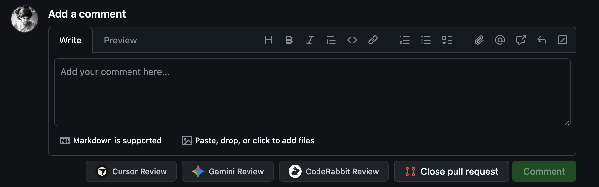
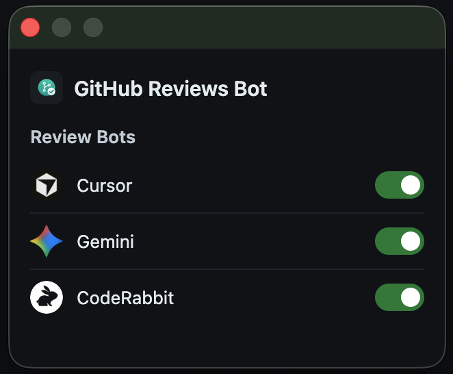

# GitHub Reviews Bot buttons

A Chrome extension that adds **one-click review buttons** to GitHub pull requests for multiple AI review bots. No more typing commands manually — just click and go.



## Supported Bots

| Bot | Command | Status |
|-----|---------|--------|
| [Cursor](https://cursor.sh) | `@cursor review` | Ready |
| [Gemini](https://github.com/apps/gemini-code-assist) | `/gemini review` | Ready |
| [CodeRabbit](https://coderabbit.ai) | `@coderabbitai review` | Ready |

Each bot can be individually enabled or disabled from the extension popup.

## Installation

1. Clone this repository:
   ```bash
   git clone https://github.com/sabatesduran/github-reviews-bot-buttons.git
   ```
2. Open **chrome://extensions** in Chrome
3. Enable **Developer mode** (toggle in the top right)
4. Click **Load unpacked**
5. Select the cloned folder

The extension icon will appear in your Chrome toolbar.

## Usage

1. Click the extension icon and **enable the bots** you want to use
2. Navigate to any **open** or **draft** pull request on GitHub
3. Scroll to the bottom where the comment box is
4. Click the review button for the bot you want (e.g. **Cursor Review**, **Gemini Review**)
5. The extension fills in the command and submits the comment automatically

## Settings

Click the extension icon in the toolbar to enable or disable each review bot. Disabled bots won't show a button on PR pages.



## Contributing

Contributions are welcome! Here are some ways you can help:

### Adding bot icons

Gemini and CodeRabbit currently use placeholder icons. To contribute a proper icon:

1. Add a **60x60 PNG** with a transparent or solid background to the `icons/` folder
2. Name it to match the bot: `gemini-icon.png` or `coderabbitai-icon.png`
3. Make sure the icon is clear and recognizable at small sizes (it displays at 20x20 in the button)

### Adding a new review bot

To add support for a new bot:

1. Add the bot's icon (60x60 PNG) to `icons/`
2. In `bots.js`, add an entry to the `BOT_CONFIGS` array:
   ```js
   {
     id: 'your-bot',
     name: 'Your Bot',
     command: '@your-bot review',
     icon: 'icons/your-bot-icon.png',
     dataId: 'grb-btn-your-bot',
   }
   ```
3. In `manifest.json`, add the icon path to `web_accessible_resources`

That's it — the popup toggles and PR page buttons are auto-generated from `bots.js`.
